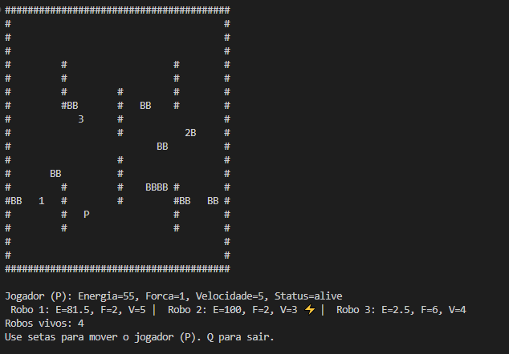

# <span style="color: #8B008B">Trabalho Final de Sistemas Operacionais I</span>
Integrantes do Grupo

 * Enzo Moraes da Costa 
 * Gabriel de Menezes Balthazar
 * Marcos Vinícius Alves Martins
 * Pedro Caetano Pires

Professor
 * Helio do Nascimento Cunha Neto

 ## <span style="color: #8B008B"></span>


Antes de tudo, precisamos ressaltar que essa prevenção está numa branch separada, chamada de 'preventDeadlock', e não na main.<br>

### <span style="color: #8B008B">Como isso funciona?</span>

Durante o desenvolvimento do programa, identificamos que era possível a ocorrência de um **deadlock clássico** em situações onde múltiplos robôs competem pelos mesmos recursos compartilhados: as baterias e o grid do jogo.

#### <span style="color: #8B008B">Cenário do Deadlock</span>

O deadlock ocorre quando dois ou mais robôs adquirem mutexes em ordens diferentes, criando uma dependência circular:

1. Robô A adquire o `grid_mutex` e depois tenta adquirir o `battery_mutex` de uma bateria específica
2. Robô B já possui o `battery_mutex` da mesma bateria e tenta adquirir o `grid_mutex`
3. Resultado: Robô A espera pelo mutex que Robô B possui, enquanto Robô B espera pelo mutex que Robô A possui

Esta situação cria uma **espera circular** onde nenhum dos robôs pode prosseguir, travando todo o sistema.

#### <span style="color: #8B008B">Condições para Deadlock</span>

O deadlock acontece quando todas as quatro condições são satisfeitas:
- Exclusão mútua: Os mutexes só podem ser possuídos por um robô por vez
- Posse e espera: Robôs mantêm recursos enquanto esperam por outros
- Não preempção: Mutexes não podem ser forçadamente liberados
- Espera circular: Existe um ciclo de dependências entre os robôs

### <span style="color: #8B008B">Exemplo de Deadlock Detectado</span>

Robô 0 adquire `grid_mutex` e tenta se mover para a bateria 1, enquanto o robô 4 já possui `battery_mutex` da bateria 1 e tenta adquirir o `grid_mutex`: 

**Robô 0 (possui grid_mutex, quer battery_mutex):**
```
[12:15:15.793] Robo 0 - grid_mutex ADQUIRIDO
[12:15:15.796] Robo 0 - Encontrou bateria 1, adquirindo mutex
[12:15:15.796] RISCO DE DEADLOCK: Robo 0 - Tentando adquirir battery_mutex já tendo grid_mutex
[12:15:15.848] Robo 0 - TENTANDO ADQUIRIR battery_mutex da bateria 1
```

**Robô 4 (possui battery_mutex, quer grid_mutex):**
```
[12:15:16.033] Robo 4 - ADQUIRINDO grid_mutex para mover de (2,12) para (3,12)
[12:15:16.033] RISCO DE DEADLOCK: Robo 4 - Adquirindo grid_mutex primeiro
[12:15:16.033] RISCO DE DEADLOCK: Robo 4 - Já possui mutex da bateria 1
```

**Resultado**: O deadlock ocorre e nenhum outro robô consegue se mover, causando o travamento completo do jogo.

### <span style="color: #8B008B">Prevenção Implementada</span>

Para resolver este problema, fizemos a aquisição ordenada de recursos:

#### <span style="color: #8B008B">Ordem consistente para mutexes</span>

Todos os robôs agora seguem a mesma ordem de aquisição: `battery_mutex` → `grid_mutex`

```python
#Ordem consistente em ambas as funções try_move e try_move_to_battery
if not self.acquire_battery_mutex(battery_id): #Se não conseguir adquirir o mutex da bateria, não prossegue
    #...
    return
try:
    #...
    with self.shared_state.grid_mutex: #Adquire o mutex do grid
        # Processa movimento
```

Esta implementação está presente nas funções `try_move` e `try_move_to_battery` da classe `robot.py`, garantindo que não hajam deadlocks.

Nos logs:

```
[19:14:20.152] Robo 1 - TENTANDO ADQUIRIR battery_mutex da bateria 1
[19:14:20.152] Robo 1 - battery_mutex da bateria 1 ADQUIRIDO COM SUCESSO
[19:14:20.152] Robo 1 - ADQUIRINDO grid_mutex para mover de (15,4) para (15,3)
[19:14:20.152] PREVENÇÃO DEADLOCK: Robô 1 - Seguindo ordem consistente: battery_mutex → grid_mutex
[19:14:20.153] Robo 1 - grid_mutex ADQUIRIDO
```

## <span style="color: #8B008B">O que é o que?</span>

### <span style="color: #8B008B"> - main.py</span>

É a classe que é responsável por inicializar o programa. Logo de cara ela limpa um possível arquivo de log já existente, para poder manter a consistência de o log só retratar uma única execução. Além disso, ela inicializa o grid na memória compartilhada, instancia os robôs e fica responsável por administrar todo o processo, de forma que está sempre esperando um input do usuário para ou movimentar o player (através de inputs nas teclas de seta enviados para a classe robot.py) ou encerrar o jogo manualmente (através do input da tecla 'q'). Por fim, também é responsável por atualizar os estados do jogo como um todo.

### <span style="color: #8B008B"> - viewer.py</span>

É a classe responsável por printar o jogo na tela, como o mapa, os status dos robos e a mensagem final do jogo, se é Vitória ou Empate.

### <span style="color: #8B008B"> - robot.py</span>

Responsável por administrar tudo relacionados aos robôs, como inicializar com robôs atributos aleatórios, inicializar e anexar a memória compartilhada a cada robô, inicializar as baterias do mapa, realizar o movimentos dos robôs, atualizar o estado do robô, as ações referentes às baterias no mapa e lidar com os duelos entre robôs, além de uma forma rudimentar de 'IA', para tomar as decisões para os robôs não controlados pelo jogados e documentar os riscos de deadlock nas ações dos robôs. 

### <span style="color: #8B008B"> - shared_memory.py</span>

É aonde estarão todos os dados que necessitam ser compartilhados através de diferentes classes do programa, para manter esses dados 'centralizados' e evitar algum erro de transferência inconsistente ou uma ação não ter os dados necessários para alguma ação.

 ## <span style="color: #8B008B">O ciclo de funcionamento</span>

Logo após iniciar a execução, você verá a tela abaixo:



A partir disso, você verá o status de cara robô, como energia, força e velocidade, além de ver se um robô está em uma bateria recebendo carga, pelo ícone de relâmpago do lado de cada um. 